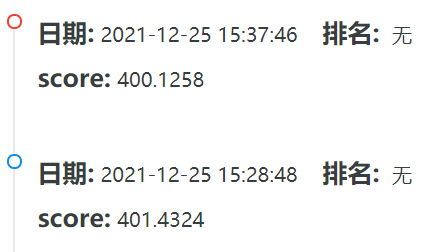

# Machine Learning
机器学习大作业

## Run
```
python run.py
```
## Result


## Thanks
[天池baseline](https://tianchi.aliyun.com/notebook-ai/detail?spm=5176.12586969.1002.3.1cd8593aazvh87&postId=95422)

[正式赛第十三名方案](https://tianchi.aliyun.com/forum/postDetail?spm=5176.12586969.1002.42.1cd8593aazvh87&postId=104728)

